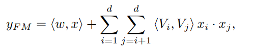
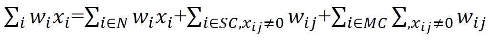
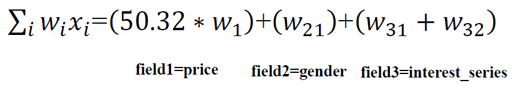
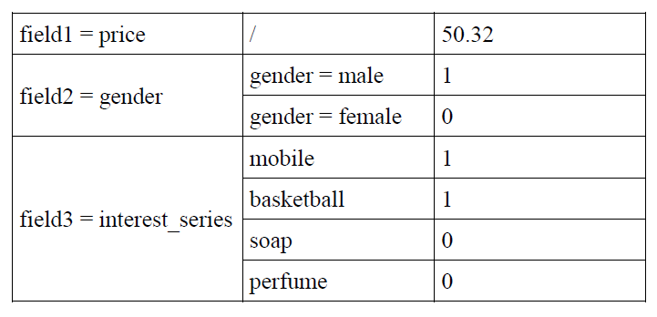
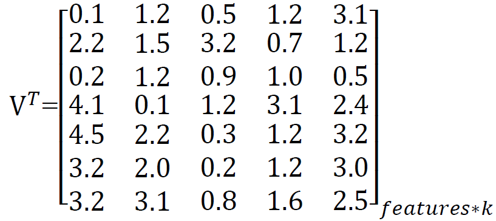
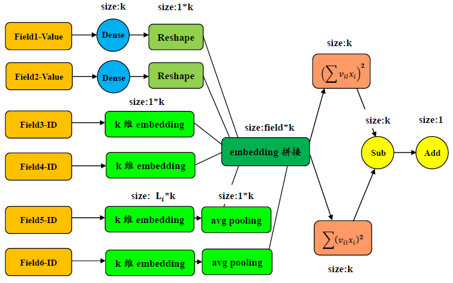
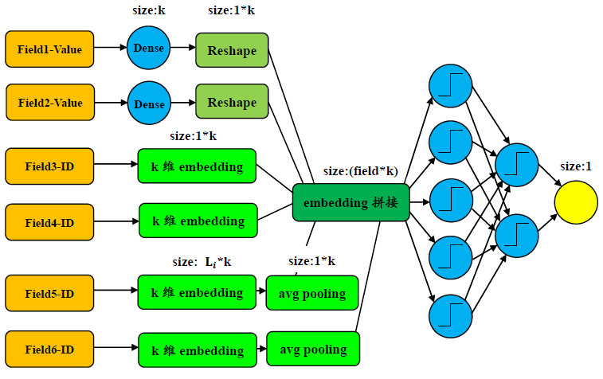

# DeepFM

假设有下面的数据，其中包含连续特征，离散单值特征，离散多值特征。

|label|price|gender|interest_series|
|---|:---:|:---:|:---:|
|0|50.32|male|mobile,basketball|
|1|44.12|female|soap,perfume,mobile|

将其one_hot后表示为：

|label|price|gender=male|gender=female|interest_series='mobile'|interest_series='basketball'|interest_series='soap'|interest_series='perfume'|
|---|:---:|:---:|:---:|:---:|:---:|:---:|:---:|
|0|50.32|1|0|1|1|0|0|
|1|44.12|0|1|1|0|1|1|

需要注意的是离散多值进行onehot时有多位为1.对每个field域中的特征分别进行单独与联合编码为：

|field|feature|separate_code|union_code|
|:---:|:---:|:---:|:---:|
|price|value|1|1|
|gender|male|1|2|
|gender|female|2|3|
|interest_series|mobile|1|4|
|interest_series|basketball|2|5|
|interest_series|soap|3|6|
|interest_series|perfume|4|7|

那么可以得到稀疏特征表示：

|label|represent|
|:---:|:---:|
|0|1:50.32 2:1 4:1 5:1|
|1|1:44.12 3:1 4:1 6:1 7:1|

接着输入给wide部分与deep部分的数据即为上述的稀疏输入

### FM部分

如图，分为一阶特征与二阶交叉特征，对于一阶特征，有

#### 一阶特征

其中N, SC, MC分别表示连续性取值,单一离散取值和多个离散取值,i表示field,j表示feature.那么上图中的单一样本的计算结果为:

当然的，在真正计算的之前，需要将连续特征50.32归一化在0-1之间

#### 二阶特征

由之前编码中联合编码可知，总的编码长度为7，那么学习的隐藏embedding矩阵应该有7行。

对不同特征的处理如下：

- 连续值特征：将连续值（经过归一化后的结果）与对应embedding相乘得到连续值的编码

- 离散单值：获取联合编码ID对应的embedding向量

- 离散多值：获取联合编码ID对应的embedding向量并做mean-pooling

接着按照下图进行交叉计算：

### Deep部分

### 代码coding

对于deepFM的输入，有可能有连续值的输入，也有可能有离散类别特征的输入，对于爱好，总的可能取值为{打游戏，看电影，看新闻}，对于学历，总的可能取值为{本科，研究生，博士}

| age  | 月收入 | price | 爱好   | 学历   |
| ---- | ------ | ----- | ------ | ------ |
| 18   | 5000   | 10    | 打游戏 | 本科   |
| 30   | 10000  | 20    | 看电影 | 研究生 |
| 40   | 20000  | 30    | 看新闻 | 博士   |

先进行feature_index编码，得到：

{"age":0, "月收入"}

