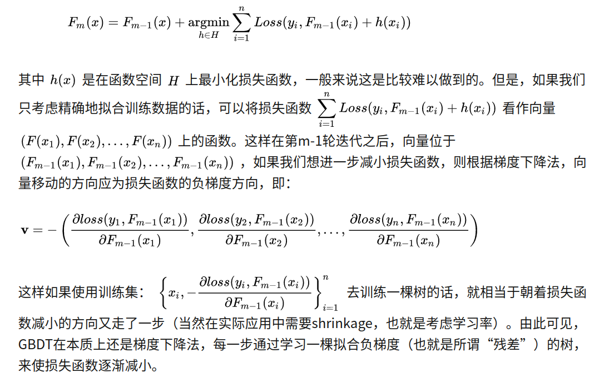
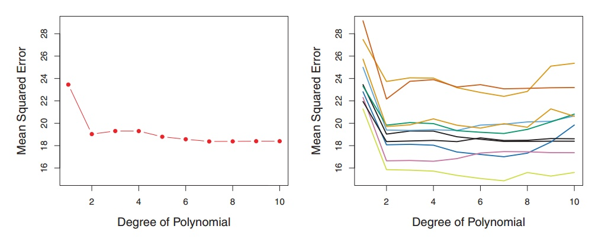

### 集成学习

之前已经从理论角度分析过集成学习算法族，见[集成学习算法](https://zhuanlan.zhihu.com/p/97200320)，以及LightGBM性能优化[LightGBM性能优化](https://zhuanlan.zhihu.com/p/102281499)。这次将从工程实践的角度来分析如何使用它们

### 方差与偏差分析

偏差是指由有所采样得到的大小为m的训练数据集，训练出的所有模型的输出的平均值和真实模型输出之间的偏差。方差是指有所有采样得到的大小为m的训练数据集，训练出的所有模型的输出的方差

Boosting、Bagging与Stacking都是聚合的方法，应该视不同的情况使用不同的方法，如果我们选择具有低偏置高方差的基础模型，我们应该使用一种倾向于减小方差的聚合方法；而如果我们选择具有低方差高偏置的基础模型，我们应该使用一种倾向于减小偏置的聚合方法。

- Bagging

Bagging策略是对样本进行重采样，对每一个重采样得到的子样本集训练一个模型，最后取平均。由于子样本集合的相似性以及使用的是相同模型，得到的每个模型具有相同的均值与方差（相同的bias与variance）。由于：

$$E\[\frac{\sum{X_i}}{n}\]=E\[X_i\]$$，所以bagging后的子模型与单个模型一致，并不能显著降低bias。另一方面，**当各个子模型完全独立时，则有**$$Var(\frac{\sum{X_i}}{n})=\frac{Var(X_i)}{n}$$。当各个模型完全一致时，即所有模型完全相关，得到$$Var(\frac{\sum{X_i}}{n})={Var(X_i)}$$。而bagging策略得到的模型虽说不是完全独立，但也不是完全相关的。所以bagging得到的模型方差应该介于两者之间，可以一定程度上减小方差。**为了进一步降低方差，随机森林会对特征进行随机采样，使用特征子集建立每个树模型**。这样以来，使得每棵树训练使用的特征尽量不一致，减小每个模型之间的相关性。另外，使用特征子集训练得到的树模型也会起到避免过拟合的作用。

既然Bagging算法能够有效的降低方差，无法降低偏差。我们训练时，使用的基模型应该选择尽量小的偏差。**所以，随机森林训练得到的树模型一般要求要较深一点**

- Boosting

而对于Boosting算法，采用的是前向分步算法。每一步都是基于前面时间步的树模型，sequential的优化损失函数。我们得到的每个模型是强相关的，所以Boosting不能显著的降低方差，能降低偏差。

既然Boosting算法可以显著的降低偏差，无法降低方差，那么我们boosting算法训练的基模型应该选择尽量小的方差，否则我们最后得到的boosting模型方差很大。这就需要我们限制树模型的复杂度，避免基模型过拟合。

- Stacking

异质集成，并且通过学习一个元模型将这些模型组织起来。

### CART学习方法

### GBDT学习步骤

- 学习流程

  

- 从对数几率回归理解GBDT

  对于线性回归而言，目标是拟合：
  $$
  y=w^{T}x+b
  $$
  如果将目标y换成y的衍生物，就可以得到广义的线性模型。例如，将y换为 $lny$ 时，我们得到对数线性回归。更一般的，有单调可微的函数g，令：
  $$
  y=g^{-1}(w^{T}x+b)
  $$
  对数线性回归就是 $g=ln$ 的特例。
  
  如何理解逻辑回归呢？将对数几率函数（sigmoid函数）作为 $g^{-}$ 函数带入上式，可得到：
  $$
  y=\frac{1}{1+e^{w^{T}x+b}}
  $$
  ,这里的y表示预测的概率，经过转化得到：
  $$
  ln{\frac{y}{1-y}}=w^Tx+b
  $$
  一般的，我们称y为预测为正样本的概率，1-y为预测为负样本的概率，两者的比值称为几率odds，反映了作为正例的相对可能性，取对数则为对数几率。那么，本质上，逻辑回归还是用 $w^Tx+b$ 去逼近对数几率，所以也称之为对数几率回归。
  
  当GBDT用于回归的时候，我们也是用的一系列CART回归树去拟合对数几率，即
  $$
  P(y=1|x)=\frac{1}{1+e^{-\sum _{m=0} ^ M h_m(x)}}
  $$
  即我们实际是用GBDT模型 $\sum _{m=0} ^M h_m(x)$ 去拟合对数几率 $ln(\frac{p}{1-p})$
  
- GBDT分类时关于 $F_0(x)$ 的初始化

  https://blog.csdn.net/On_theway10/article/details/83576715

  https://blog.csdn.net/anshuai_aw1/article/details/83048709

  GBDT在分类的时候，实际是使用 $F(x)$ 去拟合对数几率，所以可以将 $F_0(x)$ 去拟合数据集的先验对数几率。

### Boosting算法参数

- Shrinkage(学习率learning_rate)

每走一小步逐渐逼近结果的效果要比每次迈一大步很快逼近结果的方式更容易避免过拟合，即它并不是完全信任每一棵树。而是会给没棵树一个权重。把大步切成小步。本质上 Shrinkage 为每棵树设置了一个 weight，累加时要乘以这个 weight，当 weight 降低时，基模型数会配合增大

- 控制过拟合

    - 步长学习率的设置
    
    - 自采样比例，无放回的抽样
    
    - 剪枝，限制树模型的复杂程度
    
- XGBoost

    - Boosting集成架构参数
    
        - booster：CART、或者线性模型、或者DART
        
        - objective：任务目标种类

    - 弱学习器参数
    
        - max_depth:树的深度
    - min_data_in_leaf：叶子可能具有的最小记录数
        - min_sum_hessian_in_leaf（min_child_weight）：叶子节点的最小权重和，调大可以防止过拟合。
    - feature_fraction：例如 为0.8时，意味着在每次迭代中随机选择80％的参数来建树
        - bagging_fraction：每次迭代时用的数据比例
        - bagging_freq（subsample_freq）：bagging 的频率，0 表示禁止 bagging，正整数表示每隔多少个迭代进行 bagging。
        - lambda_l1（reg_alpha）：L1 正则化项，同 XGBoost。
        - lambda_l2（reg_lambda）：L2 正则化项，同 XGBoost。
        - min_gain_to_split：描述分裂的最小 gain

### 交叉验证

​		首先，交叉验证是一种评估模型好坏的方法，本身不具有调参的功能。只有当GridSearch与交叉验证CV联合起来才能起到调参的作用。试想一下，我们如何进行模型验证，最简单的方法就是将整个数据集合划分为训练集合与测试集合，在训练集合上训练，然后在测试集合上测试模型性能。但是这回有以下两个缺点：

* 最终 模型的选取与评估会非常依赖数据划分的方法，也许是因为划分生成的数据质量高，得到了比较好的模型以及评估效果。

  

  上图的右图中，是10种不同的数据划分方法得到的测试集合test MSE，可以看到在不同的划分方法下，test MSE变动是非常大的。所以如果我们的训练集和测试集的划分方法不够好，很有可能无法选择到最好的模型与参数。

* 上述方法只用了部分数据进行模型训练，可能导致训练数据不充足

基于这样的背景，交叉验证方法被提出。我们每次的测试集将不再只包含一个数据，而是多个，具体数目将根据K的选取决定。具体步骤如下：

* 将所有数据分为K分
* 不重复的选择其中1分作为测试集合，训练出K个模型
* 取K个模型的平均值作为最后的结果

如何理解交叉验证的bias-variance trade-off？

​		K越大，每次投入的训练集的数据越多，模型的Bias越小。但是K越大，又意味着每一次选取的训练集之前的相关性越大（考虑最极端的例子，当k=N，也就是在LOOCV里，每次都训练数据几乎是一样的）。而这种大相关性会导致最终的test error具有更大的Variance。为什么相关性越大会导致方差大呢？

​		K个模型，每个模型的均值与方差应该都应该是相同的。当K个模型完全独立时，有：

### LGB、XGB调参方法

需要注意的是，在调参之前，是否需要对迭代次数（num_tree或者num_boosted）调节。如果需要的话，需要设置好其他初始参数：

~~~
params = {
    'boosting_type': 'gbdt', 
    'objective': 'regression', 

    'learning_rate': 0.1, 
    'num_leaves': 50, 
    'max_depth': 6,

    'subsample': 0.8, 
    'colsample_bytree': 0.8, 
    }
~~~

验证的代码如下：

~~~python
data_train = lgb.Dataset(df_train, y_train, silent=True)
cv_results = lgb.cv(
    params, data_train, num_boost_round=1000, nfold=5, stratified=False, shuffle=True, metrics='rmse',
    early_stopping_rounds=50, verbose_eval=50, show_stdv=True, seed=0)

print('best n_estimators:', len(cv_results['rmse-mean']))
print('best cv score:', cv_results['rmse-mean'][-1])
~~~

early_stopping_rounds一定需要设定early_stopping_rounds，否则是没有办法选择最优的迭代次数的。当然，一般情况下，我们是不需要调节这个参数的，因为这个最优的迭代次数仅仅限于当前设置的初始参数。接下来，在实际试验中，如何来调参呢？

* 设定开始的基础参数{param0}

* 在训练集合上做cross-validation，画出学习结果与树棵数（boosting迭代次数）的关系

* 判断模型过拟合还是拟合，更新相应参数为param1

  * 过拟合解决方法
    * 降低模型复杂度：max_depth、min_child_weight、gamma
    * 随机化：subsample、colsample_bytree，特征采样，用较少的特征来训练一棵树，这样的树就不会过于复杂
    * 正则化：lambda、alpha

* 重复2 3步，并确定树的棵数n_estimators

* 采用参数{param1}、n_estimators，训练模型，并应用到测试集合

* 调整学习率

  * 降低learning_rate，当然同时，提高n_estimators。因为学习率减小，收敛的就会比原来慢，相对应的，应该增大n_estimators来平衡。

| **Faster Speed**                          | better accuracy                                 | over-fitting                                           |
| ----------------------------------------- | ----------------------------------------------- | ------------------------------------------------------ |
| 将 `max_bin` 设置小一些                   | 用较大的 `max_bin`                              | `max_bin` 小一些                                       |
|                                           | `num_leaves` 大一些                             | `num_leaves` 小一些                                    |
| 用 `feature_fraction` 来做 `sub-sampling` |                                                 | 用 `feature_fraction`                                  |
| 用 `bagging_fraction 和 bagging_freq`     |                                                 | 设定 `bagging_fraction 和 bagging_freq`                |
|                                           | training data 多一些                            | training data 多一些                                   |
| 用 `save_binary` 来加速数据加载           | 直接用 categorical feature                      | 用 `gmin_data_in_leaf 和 min_sum_hessian_in_leaf`      |
| 用 parallel learning                      | 用 dart                                         | 用 `lambda_l1, lambda_l2 ，min_gain_to_split` 做正则化 |
|                                           | `num_iterations` 大一些，`learning_rate` 小一些 | 用 `max_depth` 控制树的深度                            |

当然，我们也可以使用sklearn提供的GridSearchCV来调参，即网格搜索+交叉验证，其参数包括：

* estimator：分类器
* para_grid：需要优化的参数取值
* scoring：准确度评价标准
* cv：交叉验证参数

~~~
parameters = {
    'max_depth': [4,6,8],
    'num_leaves': [20,30,40],
}

gbm = lgb.LGBMClassifier(objective = 'binary',
                         is_unbalance = True,
                         metric = 'binary_logloss,auc',
                         max_depth = 6,
                         num_leaves = 40,
                         learning_rate = 0.1,
                         feature_fraction = 0.7,
                         min_child_samples=21,
                         min_child_weight=0.001,
                         bagging_fraction = 1,
                         bagging_freq = 2,
                         reg_alpha = 0.001,
                         reg_lambda = 8,
                         cat_smooth = 0,
                         num_iterations = 200,   
                        )
gsearch = GridSearchCV(gbm, param_grid=parameters, scoring='roc_auc', cv=3)
gsearch.fit(X_0_train, Y_0_train)
print('参数的最佳取值:{0}'.format(gsearch.best_params_))
print('最佳模型得分:{0}'.format(gsearch.best_score_))
print(gsearch.cv_results_['mean_test_score'])
print(gsearch.cv_results_['params'])
~~~

参考资料：

1.[LightGBM调参](https://www.cnblogs.com/bjwu/p/9307344.html)

