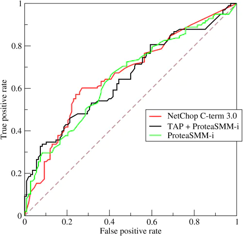

# AUC评估

## 基础介绍

​		以二分类为例，当评估模型好坏的时候，我们经常使用准确率、召回率以及F1值。但是，关于这些值的评估都需要预先选定一个阈值来判断是正类还是负类，评估的结果也会受到阈值选取的影响。如何抛去阈值选择的影响，提出使用ROC-AUC的评估方法。

​		ROC曲线的绘制方法：使用“真正例率”作为纵轴，横轴为“假正例率”绘制曲线。

|          | 真实为正 | 真实为负 |
| -------- | -------- | -------- |
| 预测为正 | TP       | FP       |
| 预测为负 | FN       | TN       |

$$
真正例率=\frac{TP}{TP+FN}，
假正例率=\frac{FP}{FP+TN}
$$

​		

将分类阈值设置为最大，所有样本全部预测为负例，有 $TP=FP=0$，此时真正例率=假正例率=0，过原点。当分类阈值设置为最小，所有样本全部预测为正例，有 $FN=TN=0$，此时真正例率=假正例率=1。(0,1)的点对应着将所有正例排在所有反例之前的理想模型。

## 实践中的遇到的问题

模型训练过程，需要跟踪训练每个batch的AUC。**这时需要注意一个问题，训练数据集（假设是不均衡数据集）必须是打乱的，否则可能会导致整个batch内的数据全部都是负例**，导致在计算的时候 $TP=FN=0$，此时没办法计算AUC值。

问题描述：模型在训练过程中，AUC值一直为0，没有变化

~~~python
if mode == tf.estimator.ModeKeys.TRAIN:
      auc = tf.metrics.auc(labels=tf.reshape(label,[-1]), predictions=tf.reshape(probabilities,[-1]))
      logging_hook = tf.train.LoggingTensorHook({"loss": total_loss,"auc":auc[0]}, every_n_iter=50)
      with tf.name_scope("BackPropagation"):
          train_op = optimization.create_optimizer(
              total_loss, learning_rate, num_train_steps, num_warmup_steps, use_tpu)
      output_spec = tf.contrib.tpu.TPUEstimatorSpec(
          mode=mode,
          loss=total_loss,
          train_op=train_op,
          training_hooks=[logging_hook],
          scaffold_fn=scaffold_fn)
~~~

问题原因：API tf.metrics.auc属于低阶的API，在使用这个API时，需要注意

* 需要进行sess.run(tf.local_variables_initializer())

* 在获取AUC值的时候，需要进行update_op操作，才能获取新的值

* 获取的AUC是流式的，即当前见到的所有batch的AUC的平均值。如下所示：

  ~~~python
  auc, update_op = tf.metrics.auc(labels=tf.reshape(label, [-1]), predictions=tf.reshape(probabilities, [-1]))
      output_spec = None
      if mode == tf.estimator.ModeKeys.TRAIN:
        with tf.control_dependencies([update_op]):
            with tf.name_scope("BackPropagation"):
                train_op = optimization.create_optimizer(
                    total_loss, learning_rate, num_train_steps, num_warmup_steps, use_tpu)
        logging_hook = tf.train.LoggingTensorHook({"loss": total_loss, "auc": auc}, every_n_iter=50)
  ~~~

由于我们使用的是Estimator，没有定义会话，所有第一个操作很难实现。因此修改了AUC计算的源码，不用初始化，并且可以传入当前的batch，直接计算当前batch的AUC，不再像之前有累积AUC的平均概念。见[AUC计算](./auc_calculate.py)