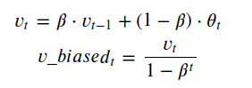

# 滑动平均

### 使用滑动平均计算局部均值

它又叫做指数加权平均，可以用来估计变量的局部均值，使得变量的更新与一段时间内的历史取值有关。假设变量 $v$ 在t时刻的shadow取值为 $v_t$，$\theta_t$ 为变量v在t时刻的取值。当不使用滑动平均模型时，有 $v_t=\theta_t$，在使用滑动平均后，有

$$v_t=\beta * v_{t-1} + (1-\beta) * \theta_t$$

当 $\beta = 0$时，没有使用滑动平均。**实际上，上述的滑动平均公式指t时刻变量v的滑动取值值大致等于过去$1/(1-/beta)$个时刻 $\theta$的平均值**。但是在滑动平均刚开始计算的时候，由于没有积累到$1/(1-/beta)$个数据，刚刚开始的时候与真实值往往差异很大。所以对vt进行矫正变为 $v\_biased_t$，即：



最开始t比较小，相当于将vt进行一定比例的放大。后期t比较大，$v\_biased_t$与$v_t$大致相等。应用场景：假设Tensorflow训练时需要统计每个特征的最大值、最小值以及平均值等，以便在预测或评估阶段使用。这时，有三种方法实现，
- 使用特征全局的最大值与最小值

    全局最大最小值可以预先通过Spark统计得到，但是这种方法会造成得到的最值往往偏大或者偏小（噪声），不太准确

- 使用mini-batch的滑动平均值
    
    训练阶段，每个批次的数据都有最大值和最小值，可以使用每个批次数据的min、max的滑动平均用于预测或者评估阶段的归一化。
    
```python
import tensorflow as tf
def build_mode(features, mode, params,is_training):
  net_numeric= tf.feature_column.input_layer(features, params['numeric_feature_columns'])
  pop_min=tf.get_variable('pop_min',shape=[numeric_feature_columns.__len__()],initializer=tf.zeros_initializer,trainable=False)
  pop_max = tf.get_variable('pop_max',shape=[numeric_feature_columns.__len__()],initializer=tf.zeros_initializer, trainable=False)
  def min_max_scale_train():
    batch_max=tf.reduce_max(net_numeric,axis=0)
    batch_min=tf.reduce_min(net_numeric,axis=0)
    decay=0.99
    train_max=tf.assign(pop_max,pop_max*decay+batch_max*(1-decay))
    train_min=tf.assign(pop_min,pop_min*decay+batch_min*(1-decay))
    with tf.control_dependencies([train_max,train_min]):
      return batch_min_max_scale(net_numeric,batch_min,batch_max)
  def min_max_scale_inference():
    return batch_min_max_scale(net_numeric,pop_min,pop_max)
  min_scale_out=tf.cond(tf.cast(is_training,tf.bool),min_max_scale_train,min_max_scale_inference)
  net_no_numeric=tf.feature_column.input_layer(features,params['no_numeric_feature_columns'])

``` 

### Tensorflow使用滑动平均来更新参数

滑动平均可以看作是变量的过去一段时间取值的均值，相比对变量直接赋值而言，滑动平均得到的值在图像上更加平缓光滑，抖动性更小，不会因为某次的异常取值而使得滑动平均值波动很大.


对于随机梯度下降而言，更平滑的更新说明不会偏离最优点很远；对于梯度下降 batch gradient decent，我感觉影子变量作用不大，因为梯度下降的方向已经是最优的了，loss 一定减小；对于 mini-batch gradient decent，可以尝试滑动平均，毕竟 mini-batch gradient decent 对参数的更新也存在抖动。


### 滑动平均为什么通常在测试过程中使用

对神经网络边的权重 weights 使用滑动平均，得到对应的影子变量 shadow_weights。在训练过程仍然使用原来不带滑动平均的权重 weights，不然无法得到 weights 下一步更新的值，又怎么求下一步 weights 的影子变量 shadow_weights。之后在测试过程中使用 shadow_weights 来代替 weights 作为神经网络边的权重，这样在测试数据上效果更好