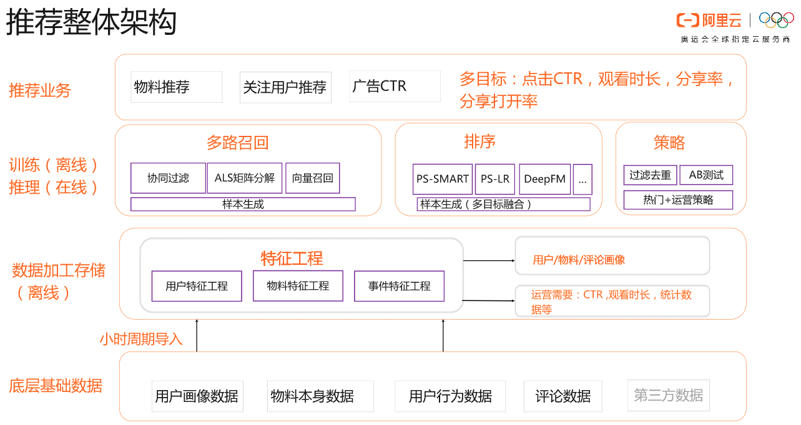
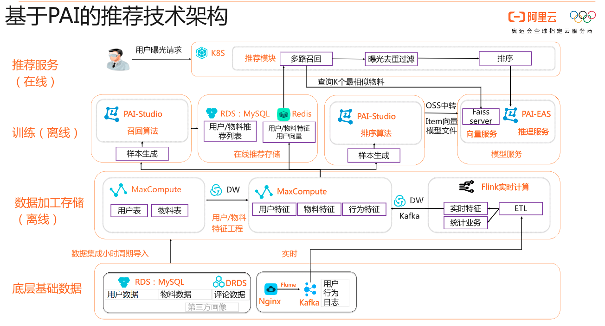
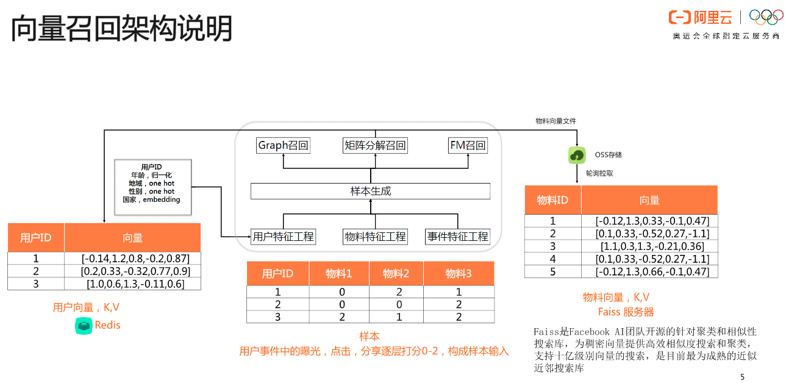
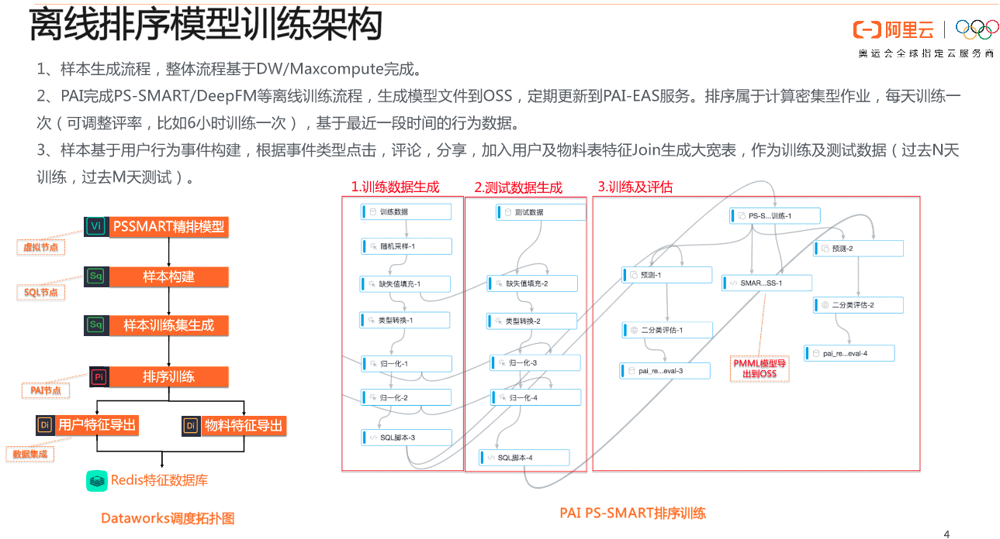
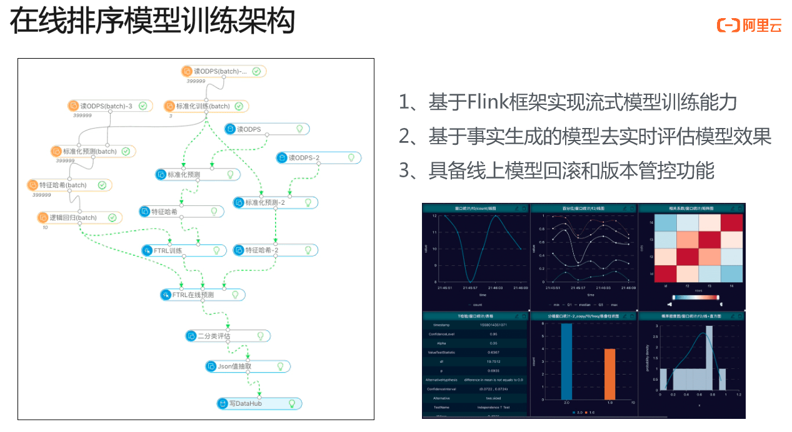
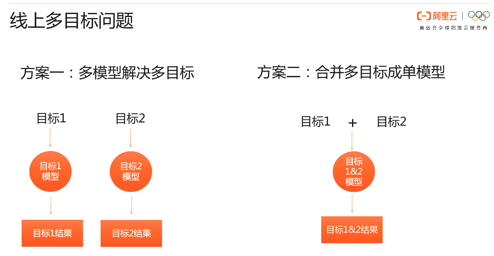

# 推荐系统

### 推荐系统整体架构

如图，下面两层不用解释，主要是对数据进行说明以及特征工程。召回部分使用了多路召回，排序部分使用**多目标融合进行排序。**排序之后，会进行一个策略调整。具体有哪些策略？

- 过滤去重

    比如用户昨天买了手机，今天就不能再给用户推手机了
    
- 运营策略

    比如最近疫情期间应该主要推口罩，所以应该尽量将口罩放在前面
    
### 基于阿里PAI的推荐技术架构

- 底层数据基础

    底层用户数据包括：用户数据、物料数据以及评论数据，这些存储在MySQL或者是NoSQL中。对于用户行为日志，一般存储在Kafka中。

- 数据加工存储

    用户数据、物料数据以及评论数据可以根据Spark离线加工后存储在HDFS上。Kafka中的用户行为日志可以通过流计算生成实时特征，将用户/物料特征以及实时特征join起来，得到：
    
    **××[用户特征 物料特征 行为特征]××**

- 离线模型训练

    - 召回模型训练
    
        使用协同过滤得到用户/物料推荐列表存储在MySQL，使用类似GraphEmbedding或者其他pretrain的方法将训练得到的用户/物料特征向量存储在redis中。
        
        线上会使用多路召回算法，对于使用Embedding召回的召回路，可能会借助FaceBook的Faiss Server完成向量召回。Faiss是一个寻找TopK性能极强的框架，能够在秒级别时间内处理上亿向量。
        
        对于每一路的召回，其之间可能存在重复item，再加上前面提到的过滤去除原则，使用**布隆过滤器**完成去重，然后接排序算法完成排序。
    
    - 排序模型训练

- 在线推荐服务

    为了能够弹性的使用资源，将所有服务模块：多路召回模块、曝光去除过滤以及排序放在K8S集群上
    
### 召回算法架构

### 排序算法架构

排序算法训练分为离线训练和在线训练，其结构分别如下：

对于在线学习，并不是从0开始训练，而是基于离线训练的结果进行train。在线学习的输入数据源来自data流，模型会定时的去做验证。对于在线模型的验证方法，有一下两种解决方案：

- 取data流前面时间窗的数据（模型从未见过的），进行AUC评估

- 取一部分过去N天前的数据，加入到上面方案一的数据集合中，这种方法主要是为了验证模型是否因为流的局部pattern被带偏
 
### 线上多目标问题

一般的，我们会使用方案二。方案一需要同时维护两个模型，不太方便。对于方案二，比如是否点击作为一个目标，观看时长作为另一个目标，同时对两个目标进行建模。

### 拓展

#### 1.布隆过滤器去重方法
#### 2.Faiss Server为什么效率如此之高？