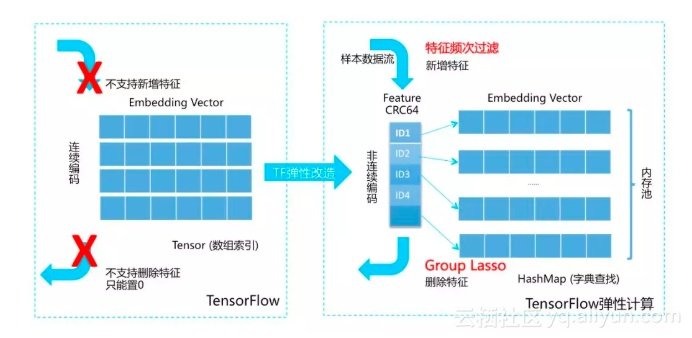
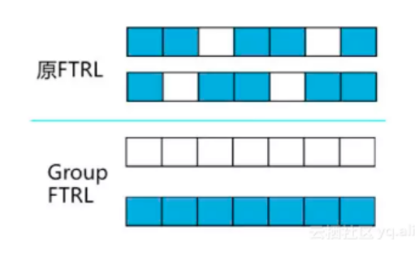
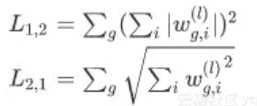
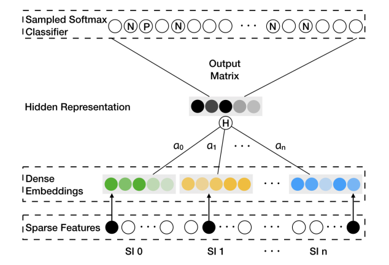
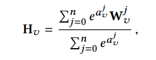
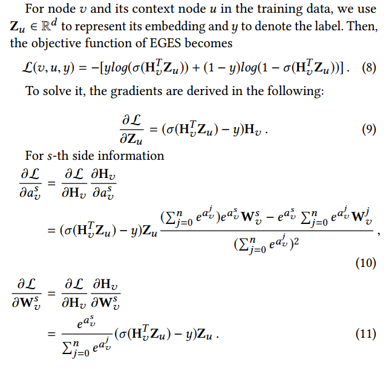

# 在线学习系统冷启动

先上论文（KDD 2018）吧：

Wang, Jizhe, et al. "Billion-scale commodity embedding for e-commerce recommendation in alibaba." *Proceedings of the 24th ACM SIGKDD International Conference on Knowledge Discovery & Data Mining*. 2018.

问题背景：在搜索咨询领域，当遇到一个计算机从来没有见过的词语，这个词语的embedding向量如何表示？在E-commerce领域，如果新上架一个商品，没有用户对该商品有过行为，如何学习商品的空间向量？对于淘宝推荐系统，存在着以下三个重要挑战：

* 稀疏性：用户只趋向于与少量商品交互，想要训练出一个比较好的推荐模型往往非常困难
* 冷启动：在淘宝，数百万的新items会在每小时持续被上传。这些items没有用户行为。处理这些items、或者预测用户对这些items的偏好是个挑战，这被称为“cold start”问题。

对于冷启问题，通过调研，我将介绍三种方法：内存空间预留算法、Tensorflow底层弹性改造以支持HashVariable以及带Side Information的Embedding算法。

### 内存空间预留算法

​		推荐排序算法中，经常会用到id特征，在输入给神经网络计算之前，需要完成Embedding的空间映射。在Tensorflow中，一般会定义一个矩阵[id_index_size，embedding_size]的参数矩阵，然后根据id特征的index去参数矩阵中索引出对应的向量作为该id的embedding表示。但现在有这样一个问题，如果未来上架了新的商品，该商品无法在参数矩阵找到对应的Embedding表示，如何解决？

​		假设离线训练的时候，商品总数是30000个，考虑到以后可能会新增商品，可以讲Embedding矩阵设置为[40000，embedding_size]。具体如何实现？

* 对已有的30000个商品排序，将商品id映射到0-30000之间的数值
* 使用[Tensorflow API](https://www.tensorflow.org/api_docs/python/tf/lookup/StaticVocabularyTable)

对于淘宝的搜索推荐场景，排序百万甚至上亿的商品比较耗时。所以，可以直接使用StaticVocabularyTable创建索引。具体用法：

~~~python
tf.lookup.StaticVocabularyTable(
    initializer, num_oov_buckets, lookup_key_dtype=None, name=None
)
~~~

对于某个商品id，假设它在30000个商品中，那么它会转化为对应的index。如果是新上架的商品，那么index将是从30000-40000之间的随机数。具体是如何映射的，这是Tensorflow底层封装的hash方法，对用户是透明的。使用这种方法最为方便，但也有如下缺点：

​		假设对于新上架的两个商品id1与id2，我们希望两个id不要映射为用一个index，但是hash冲突总是难免的，两个id有一定概率会映射为同一个index，这样会导致两个商品的embedding向量体现在矩阵的一行中。

### Tensorflow底层弹性改造

​		关于Tensorflow的弹性改造涉及算法与架构工程，本人以为这种方法是最难的，[参考资料](https://zhuanlan.zhihu.com/p/53530167)。对于在线学习系统而言，存在一下三个问题：

* 所使用的训练数据是流式数据，无法预知特征规模。而Tensorflow在对稀疏ID特征进行Embedding时，需要提前声明embedding矩阵参数，那么我们就必须提前扫描所有的id并建立映射表，当id总数非常庞大时，扫描以及映射表的存储都很昂贵。并且，在onlinelearning的场景下，为了容纳新的ID特征，往往需要预留一部分空间，假设新增的ID对应的映射值对应max+1，那么还需要不断的去维护映射表。
* 在线学习模型要求不能太复杂，模型应该尽量稀疏，否则会导致线上模型更新耗时严重。
* 在线学习应该对低频特征进行截断，否则对模型伤害太大。

为了突破以上限制，可以如下优化：

实现一个可以动态增删的HashVariable变量，其key存储的是对应的ID，value为embedding向量的首地址。其内存结构如下所示：

当新上架一个商品ID，可以动态的增加ID到向量的映射，不必再像Tensorflow传统方法那样需要预先定义一个超大的矩阵。

#### group Lasso

​		如何使得在线学习的模型稀疏？最直观的想法是使用L1正则、RDA或者FTRL算法得到稀疏模型，但是这些算法都是针对[广义线性模型](../EnsembleLearning/readme.md)的，没有针对Embedding矩阵进行特殊处理。如果把embedding参数当做普通参数来进行稀疏化，并不能达到特征选择的效果，也就无法进行模型压缩。

例如：当包含新特征的样本进入时，一个特征对应的一组参数（如embedding size为7，则参数数量为7）被激活，FTRL判定特征中的部分参数无效时，也不能安全地将该特征删除，只能将该特征的部分参数置0。如图：

可以使用group lasso，如下所示：

对于L21正则，先求出各行的L2范数，得到一个n行1列的向量，再求这个向量的L1范数，即矩阵X 每一行的L2范数 之和。进行优化时，需要正则惩罚项尽量小，则L21范数小，每一行的L2范数也需要小，行内尽可能多的为0，得到行稀疏结果。它将一个特征的所有参数施加相同的约束，能将整组参数清除或保留。而L12则正好相反，它迫使每组参数中的非0参数数量一致但值又尽可能不同，但使输出神经元互相竞争输入神经元，进而使特征对目标更具区分性。

#### 低频特征过滤

业务无关，不细讲，可以去看看文档，看看蚂蚁金服的做法。

### Side Information Embedding算法

接下来我们看看论文（Wang, Jizhe, et al. "Billion-scale commodity embedding for e-commerce recommendation in alibaba." *Proceedings of the 24th ACM SIGKDD International Conference on Knowledge Discovery & Data Mining*. 2018）是如何处理稀疏特征的？关于图的DeepWalk不是我们讲的重点，感兴趣的同学可以仔细去看一下论文，写的很详细。我们只介绍未登录商品的如何训练？

在商业推荐系统的场景中，side information常指关于一个item的：类目(category)，shop(商名)，价格(price)等，我们可以通过将side information合并到graph embedding中来缓合cold-start问题。

其中SI0是item本身，SI1-SIn为side information，在Dense Embedding中，融合item自身的embedding信息与side information embedding信息。当然，可能此时item embedding向量并不准确，因为之前从来没有被训练过。但是side information embedding信息是相对准确的，神经网络能够达到一定准确的运算。反过来，一旦新上架的商品开始不断积累了用户行为，神经网络的反向传播必然会更新该商品的embedding向量。

那么，如何融合side information的embedding信息呢？论文提出了两种方法，第一种是进行mean pooling，第二种进行加权求和。不同类型的side information对最终的embedding的贡献应该是不同的，**例如，一个购买了IPhone的用户，趋向于会浏览Macbook或者Ipad，因为品牌都是”Apple”；而一个购买了多个不同品牌衣服的用户，出于便利和更低价格，还会在相同的淘宝店上继续购买。**

这里主要是使用了一个softmax激活，将权重归一化，变为0-1之间的数值。$H_v$ 是融合后的向量。那么关于神经网络的损失函数与反向传播如下所示：

由此，便可更新权重参数矩阵与embedding参数矩阵。

### 写在最后

**最后想要说的是，三种方法并不是独立的，往往是相辅相成的。当你实现上述论文的方法时，你需要同时使用方法一和方法三。**