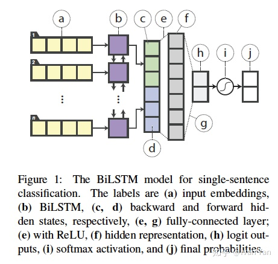
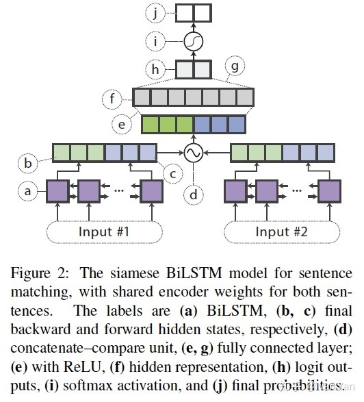
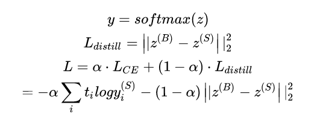
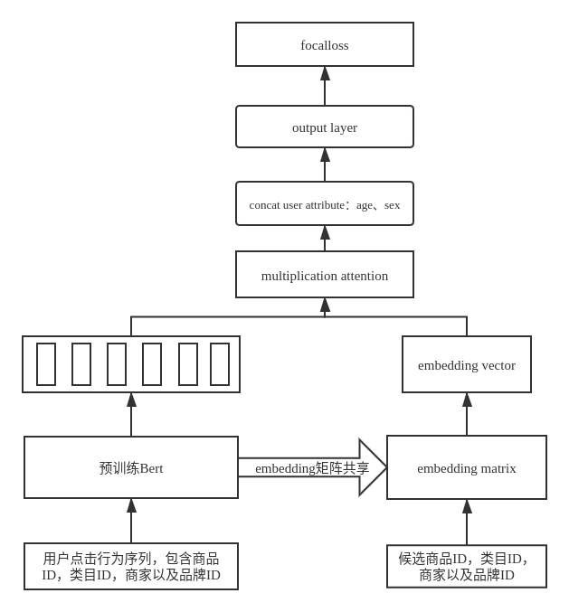

# 知识蒸馏

什么是知识蒸馏，简而言之就是模型压缩。Bert在各个领域效果好已经不用多说，但是在实际生产环境下，Bert往往不能直接放到线上使用。知识蒸馏的提出，就是为了将复杂的模型压缩，以便线上性能能够抗住。

最早的论文可见：

Hinton, Geoffrey, Oriol Vinyals, and Jeff Dean. "Distilling the knowledge in a neural network." *arXiv preprint arXiv:1503.02531* (2015).

​		大致思想是：可以先训练出一个复杂的teacher网络，然后将teacher网络的输出结果q作为student网络的目标，训练student网络，使得student网络的结果p能够尽可能接近q。因此网络损失函数为：
$$
L=CE(y,p)+\alpha*CE(p,q)
$$
​		这里的y是student网络真实的标签，q是teacher网络的输出结果，p是student网络的输出结果，而交叉熵CE就是衡量了两个概率分布之间的距离。但是有一个问题，这里teacher网络输出的q是否就是softmax的输出呢？论文在得到teacher网络的时候，做了以下运算：
$$
q_i=\frac{exp(z_i/T)}{\sum _j (z_j/T)}
$$
​		这里的 $q_i$ 就是student网络学习的对象（soft targets），$z_i$ 是teacher网络softmax前的输出。如果将T取1，这个公式就是softmax，根据logit输出各个类别的概率。如果T接近于0，则最大的值会越近1，其它值会接近0，近似于onehot编码。如果T越大，则输出的结果的分布越平缓，相当于平滑的一个作用，起到保留相似信息的作用。如果T等于无穷，就是一个均匀分布。

​		想象有这样一个问题，在数字识别中，数字2与3、7从外形上来看比较相似，但是如果在得到q时只简单的用softmax，会造成对于某个图像“2”的输入，2预测的概率非常高，而3和7的概率将接近0。这样的话，由于它们的概率值接近0，teacher网络学到数据的相似信息（例如数字2和3，7很类似）很难传达给student网络。

## 实例

#### 模型结构

Tang, Raphael, et al. "Distilling task-specific knowledge from bert into simple neural networks." *arXiv preprint arXiv:1903.12136* (2019).

假设现在需要解决两个问题：1.输入一句话进行分类 2.输入两句话，判断句子是否匹配

解决方案：预先训练Bert模型，任务为Masked LM与NSP来做pretrain，对于情况1，需要我们finetune一个Bert模型用于分类，而对于情况2可以不用再进行pretrain。那么对于情况1与情况2如何设计student网络呢？

情况1：

情况2：需要对情况2进行简单说明一下，进行特征融合时，取两个句子最后一步的biLSTM的hidden states $h_{s1}，h_{s2}$， 然后拼接为 $[h_{s1}, h_{s2}, h_{s1}h_{s2},|h_{s1}-h_{s2}|]$ 作为全连接层的输入，然后经过softmax得到匹配结果。

#### 损失函数

假设 $z=z^{(S)}$ 为student网络的输出，$z^{(B)}$为teacher网络的输出，那么损失可以按照如下计算：

student网络计算的是CE损失，而蒸馏损失为均方误差MSE

## 工程问题

问题场景：根据用户的点击序列，pretrain一个Bert模型。之后以是否点击作为标签，基于预训练的Bert Finetune一个网络模型，用于预测用户对某个商品的点击率。finetune的模型结构如下所示：

训练该网络的时候有几个点需要注意：

* 原则上，在训练该网络的时候我们应该使用transfer learning的方法。也就是freeze已经训练好的Bert的参数，只针对output layer层进行训练。这样做的好处是，如果将随机初始化的输出层与已经训练好的bert混合，随机初始化的层可能会导致整个网络有比较大的梯度，这样会导致Bert已经学习到的知识被破坏。Tensorflow官网是这样解释的：
  * It is critical to only do this step *after* the model with frozen layers has been trained to convergence. If you mix randomly-initialized trainable layers with trainable layers that hold pre-trained features, the randomly-initialized layers will cause very large gradient updates during training, which will destroy your pre-trained features.
* 实际工程实现上，我没有采用上述的方法。因为我看Bert的finetune源码也并没有固化已经训练好的Bert参数，所以我并没有显示指定Bert的参数为不可训练。**训练的时候，我将学习率降低了两个数量级，防止学习好的Bert知识被破坏（防止梯度*学习率的值过大）并防止过拟合。**Tensorflow官网对于finetune阶段有这样的解释：
  * It's also critical to use a very low learning rate at this stage, because you are training a much larger model than in the first round of training, on a dataset that is typically very small. As a result, you are at risk of overfitting very quickly if you apply large weight updates. Here, you only want to readapt the pretrained weights in an incremental way.

​		一个较为精准但是复杂的ctr预估模型经过上述训练过程已经可以得到，那么这样一个复杂的模型放到线上服务性能肯定是扛不住的。所以，这个阶段引入知识蒸馏（**注意在知识蒸馏阶段应该freeze teancher网络的参数**），用finetune出的复杂网络指导简单的student网络学习。假设我们已经通过知识蒸馏训练好student网络，但是上线时存在这样一个问题：**student网络与teacher网络定义在一张图graph中，如何只将student网络的前向传播截取出来，保存为savedmodel文件用于tfserving部署？**

​		我google了很多方法，发现有一种方法非常方便。那就是将student前向传播子图涉及到的variables固化为tf.constant tensor，并截取固化后的子图。**需要注意的是传入的是节点名称而不是tensor名称**

~~~python
#_*_coding:utf-8_*_
import tensorflow as tf
from tensorflow.python.framework import graph_util
from create_tf_record import *
 
resize_height = 224  # 指定图片高度
resize_width = 224   # 指定图片宽度
 
def freeze_graph(input_checkpoint, output_graph):
    '''
 
    :param input_checkpoint:
    :param output_graph:  PB 模型保存路径
    :return:
    '''
    # 检查目录下ckpt文件状态是否可用
    # checkpoint = tf.train.get_checkpoint_state(model_folder)
    # 得ckpt文件路径
    # input_checkpoint = checkpoint.model_checkpoint_path
 
    # 指定输出的节点名称，该节点名称必须是元模型中存在的节点
    output_node_names = "InceptionV3/Logits/SpatialSqueeze"
    saver = tf.train.import_meta_graph(input_checkpoint + '.meta', clear_devices=True)
    graph = tf.get_default_graph()  # 获得默认的图
    input_graph_def = graph.as_graph_def()  # 返回一个序列化的图代表当前的图
 
    with tf.Session() as sess:
        saver.restore(sess, input_checkpoint)  # 恢复图并得到数据
        # 模型持久化，将变量值固定
        output_graph_def = graph_util.convert_variables_to_constants(
            sess=sess,
            # 等于:sess.graph_def
            input_graph_def=input_graph_def,
            # 如果有多个输出节点，以逗号隔开
            output_node_names=output_node_names.split(","))
 
        # 保存模型
        with tf.gfile.GFile(output_graph, "wb") as f:
            f.write(output_graph_def.SerializeToString())  # 序列化输出
        # 得到当前图有几个操作节点
        print("%d ops in the final graph." % len(output_graph_def.node))
 
        # for op in graph.get_operations():
        #     print(op.name, op.values())
        
import tensorflow as tf
with tf.Session() as sess:
    #初始化变量
    sess.run(tf.global_variables_initializer())
    #获取最新的checkpoint，其实就是解析了checkpoint文件
    latest_ckpt = tf.train.latest_checkpoint("./checkpoint_dir")
    #加载图
    restore_saver = tf.train.import_meta_graph('./checkpoint_dir/MyModel-1000.meta')
    #恢复图，即将weights等参数加入图对应位置中
    restore_saver.restore(sess, latest_ckpt)
    #将图中的变量转为常量
    output_graph_def = tf.graph_util.convert_variables_to_constants(
        sess, sess.graph_def , ["out"])
    #将新的图保存到"/pretrained/graph.pb"文件中
    tf.train.write_graph(output_graph_def, 'pretrained', "graph.pb", as_text=False)
import tensorflow as tf
with tf.Session() as sess:
    with open('./pretrained/graph.pb', 'rb') as graph:
        graph_def = tf.GraphDef()
        graph_def.ParseFromString(graph.read())
        output = tf.import_graph_def(graph_def, return_elements=['out:0'])
        print(sess.run(output))
~~~

​		**因为网络其实是比较复杂的，定义了输出节点的名字，那么freeze操作的时候就只把输出该节点所需要的子图都固化下来，其他无关的就舍弃掉。因为我们 freeze 模型的目的是接下来做预测，所以 output_node_names 一般是网络模型最后一层输出的节点名称，或者说我们预测的目标。**

## 关于模型保存

​		使用 tf.train.Saver 会保存进行TensorFlow程序所需要的全部信息，然后有时并不需要某些信息。比如在测试或者离线预测时，只需要知道如何从神经网络的输出层经过前向传播计算得到输出层即可，而不需要类似于变量初始化，模型保存等辅助接点的信息。而且，将变量取值和计算图结构分成不同的文件存储有时候也不方便，于是TensorFlow提供了 convert_variables_to_constants 函数，通过这个函数可以将计算图中的变量及其取值通过常量的方式保存，这样整个TensorFlow计算图可以统一存放在一个文件中，该方法可以固化模型结构。

~~~python
import tensorflow as tf
from tensorflow.python.framework import graph_util
 
v1 = tf.Variable(tf.constant(1.0, shape=[1]), name='v1')
v2 = tf.Variable(tf.constant(2.0, shape=[1]), name='v2')
result = v1 + v2
 
init_op = tf.global_variables_initializer()
with tf.Session() as sess:
    sess.run(init_op)
    # 导出当前计算图的GraphDef部分，只需要这一步就可以完成从输入层到输出层的过程
    graph_def = tf.get_default_graph().as_graph_def()
 
    # 将图中的变量及其取值转化为常量，同时将图中不必要的节点去掉
    # 在下面，最后一个参数['add']给出了需要保存的节点名称
    # add节点是上面定义的两个变量相加的操作
    # 注意这里给出的是计算节点的的名称，所以没有后面的 :0
    output_graph_def = graph_util.convert_variables_to_constants(sess, graph_def, (['add']))
    # 将导出的模型存入文件
    with tf.gfile.GFile('model/combined_model.pb', 'wb') as f:
        f.write(output_graph_def.SerializeToString())
~~~

通过下面的程序可以直接计算定义加法运算的结果，当只需要得到计算图中某个节点的取值时，这提供了一个更加方便的方法，以后将使用这种方法来使用训练好的模型完成迁移学习。

~~~python
import tensorflow as tf
from tensorflow.python.platform import gfile
 
with tf.Session() as sess:
    model_filename = 'model/combined_model.pb'
    # 读取保存的模型文件，并将文件解析成对应的GraphDef Protocol Buffer
    with gfile.FastGFile(model_filename, 'rb') as f:
        graph_def = tf.GraphDef()
        graph_def.ParseFromString(f.read())
 
    # 将graph_def 中保存的图加载到当前的图中，
    # return_elements = ['add: 0'] 给出了返回的张量的名称
    # 在保存的时候给出的是计算节点的名称，所以为add
    # 在加载的时候给出的张量的名称，所以是 add:0
    result = tf.import_graph_def(graph_def, return_elements=['add: 0'])
    print(sess.run(result))
    # 输出 [array([3.], dtype=float32)]
~~~

## 使用固化的模型进行预测

~~~python
def freeze_graph_test(pb_path, image_path):
    '''
    :param pb_path: pb文件的路径
    :param image_path: 测试图片的路径
    :return:
    '''
    with tf.Graph().as_default():
        output_graph_def = tf.GraphDef()
        with open(pb_path, "rb") as f:
            output_graph_def.ParseFromString(f.read())
            tf.import_graph_def(output_graph_def, name="")
        with tf.Session() as sess:
            sess.run(tf.global_variables_initializer())
 
            # 定义输入的张量名称,对应网络结构的输入张量
            # input:0作为输入图像,keep_prob:0作为dropout的参数,测试时值为1,is_training:0训练参数
            input_image_tensor = sess.graph.get_tensor_by_name("input:0")
            input_keep_prob_tensor = sess.graph.get_tensor_by_name("keep_prob:0")
            input_is_training_tensor = sess.graph.get_tensor_by_name("is_training:0")
 
            # 定义输出的张量名称
            output_tensor_name = sess.graph.get_tensor_by_name("InceptionV3/Logits/SpatialSqueeze:0")
 
            # 读取测试图片
            im = read_image(image_path, resize_height, resize_width, normalization=True)
            im = im[np.newaxis, :]
            # 测试读出来的模型是否正确，注意这里传入的是输出和输入节点的tensor的名字，不是操作节点的名字
            # out=sess.run("InceptionV3/Logits/SpatialSqueeze:0", feed_dict={'input:0': im,'keep_prob:0':1.0,'is_training:0':False})
            out = sess.run(output_tensor_name, feed_dict={input_image_tensor: im,
                                                          input_keep_prob_tensor: 1.0,
                                                          input_is_training_tensor: False})
            print("out:{}".format(out))
            score = tf.nn.softmax(out, name='pre')
            class_id = tf.argmax(score, 1)
            print("pre class_id:{}".format(sess.run(class_id)))
~~~

需要注意的是，所有variables参数都转换为了tf.constant，所以执行sess.run(tf.global_variables_initializer())也不会影响到训练好的参数，因为参数都转化为了tf.constant。恢复模型非常简单，使用

~~~python
tf.import_graph_def(output_graph_def, name="")
~~~

## 注意

* 知识蒸馏，可以用来将网络从大网络转化成一个小网络，并保留接近于大网络的准确率
* 也可以将多个网络的学到的知识转移到一个网络中，使得单个网络的性能接近emsemble的结果。

